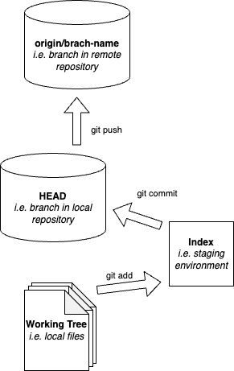
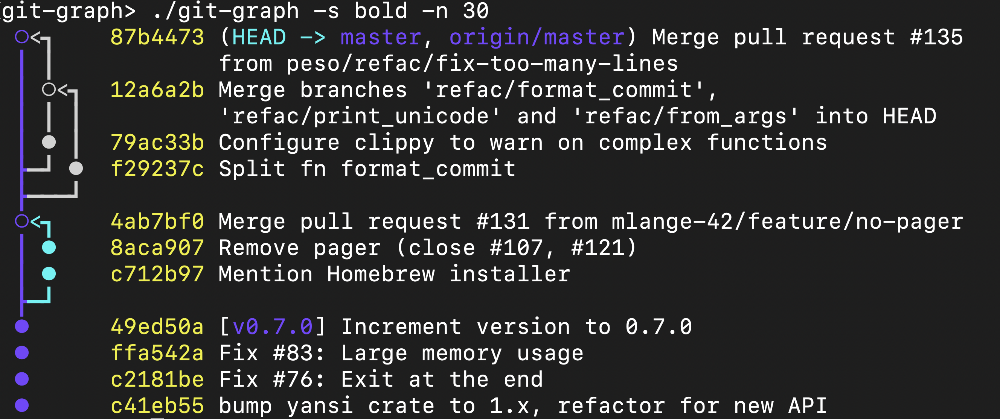
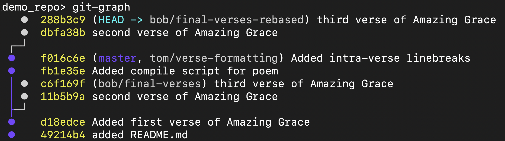

% Git & GitHub
% Joshua Zingale


# The World of Software Development
* **Building is Iterative:** We don't just write code once; we refine, refactor, and expand it over time.
* **Complexity:** Even "simple" apps can soon have hundreds of files and thousands of lines of logic.
* **The Goal:** To deliver stable, functional software while maintaining the ability to change it quickly.

---

# The "Save As" Nightmare
* **Version Fatigue:** We’ve all been there: `script_v1.py`, `script_v2_final.py`, `script_v2_final_FIXED.py`.
* **Lack of Context:** What exactly is different between this and that version?
* **Risk:** Deleting a block of code to "try something else" often means losing the original work forever if you don't have a backup.

---

# Compounding Issues in a Team
* **The "Overwriting" Problem:** Two people edit the same file at the same time. Who wins?
* **The "Broken Master" Problem:** One person's experimental code breaks the entire project for everyone else.
* **Communication Overhead:** Constantly asking "Are you working on the login page?" or "Which version is the latest?" slows down development.

---

# Enter: Version Control Systems (VCS)
* **The Time Machine:** VCS records every change made to the codebase.
* **The Auditor:** It tracks *who* made the change, *when*, and *why*.
* **The Safety Net:** It allows you to experiment boldly, knowing you can always revert to a "known good" state.
* **Git** is the industry standard for distributed version control.

---

# Git Architecture

::: columns

:::: {.column width="50%"}

::::

:::: {.column width="50%"}
## Typical workflow

```bash
# Download repo
git clone <uri>

# Edit file
vim README.md

# Track file
git add README.md

# Store fix locally
git commit -m "grammar"

# Store commit on remote
git push
```

::::
:::
---

# Core Concept: Commits & Rollbacks
* **The Snapshot:** A "Commit" isn't just a save point; it's a snapshot of your entire project at a specific moment.
* **The Hash:** Each commit has a unique ID.
* **Rollbacks:** If a new feature introduces a critical bug, you can "checkout" or "revert" to a previous commit instantly.
* *Safety first: No work is ever truly lost^[unless you like to live on the edge and use `git push -f`: don don don...].*

---

# Core Concept: Branching
* **Parallel Universes:** Branching allows you to diverge from the main project line (often called `main` or `master`).
* **Isolated Development:** You can build a "Dark Mode" feature on one branch while a teammate fixes a "Login Bug" on another.
* **Zero Interference:** Changes in a branch do not affect the main codebase until you are ready.

---

# Core Concept: Merging
* **Bringing it Together:** Once a feature is finished and tested in its branch, you "Merge" it back into the main line.
* **Automatic Integration:** Git is smart---it combines changes from different files automatically.
* **Conflict Resolution:** If two people edited the exact same line, Git pauses and asks you to choose which version to keep.

---

# Example of Branching and Merging
\

---

# Core Concept: Rebasing
* **Cleaning Up History:** Instead of a messy "merge commit," Rebasing moves your entire branch to begin on the tip of the main branch.
* **The "Linear" Advantage:** It makes the project history look like a straight line, making it much easier to read and debug.
* **Pro Tip:** Use Rebase to keep your feature branch up-to-date with the latest changes from your team.


---

# Example of Rebased Branch
\


---

# GitHub: The Social Layer
* **Git is the Engine; GitHub is the Dashboard.**
* **Collaboration:** Pull Requests (PRs) allow for code reviews and discussions before code is merged.
* **Remote Backup:** Your code lives in the cloud, accessible from anywhere.
* **Community:** Rife with open source software.

---

# GitHub Actions
* Automate development processes by executing code on GitHub events.
* Example events:
    - push to branch
    - opened pull-request to branch
    - opened issue
* Useful for Continuous Integration and Deployment (CI/CD)

---

# Example GitHub Action {.shrink}

```yml
#.github/workflows/compile-slides.yml
name: Compile Slides
on:
    push:
        branches:
            - master
permissions:
  contents: write
jobs:
    Compile-Slides:
        runs-on: ubuntu-latest
        steps:
            - name: Updating apt
              run: sudo apt-get update
            - name: Installing pandoc
              run: sudo apt-get install pandoc -y
            - name: Installing pdflatex
              run: sudo apt install texlive-latex-extra -y
            - uses: actions/checkout@v5
            - name: Compiling Slides
              run: |
                bash compile.bash
            - name: Commit slides.pdf
              run: |
                git config --local user.email "github-actions[bot]@users.noreply.github.com"
                git config --local user.name "github-actions[bot]"
                git add -f slides.pdf
                git commit -m "[chore] Compiled and saved slides" || echo "no changes"
            - name: Push Commit
              run: git push
```